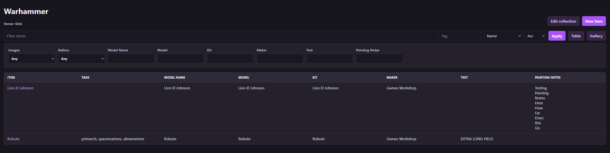
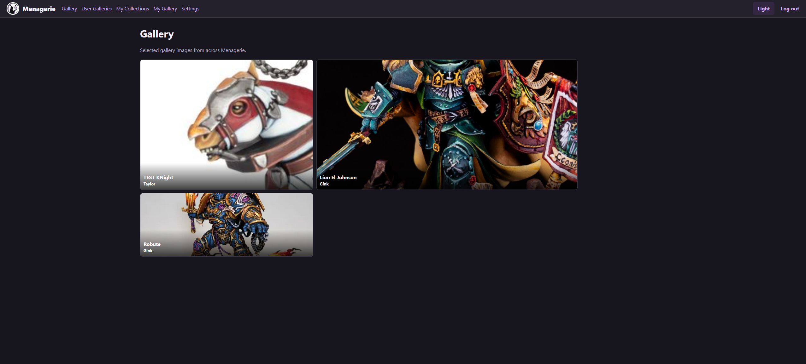

# Menagerie

Menagerie is a self-hosted web app for managing collections of physical items. It provides username/password login, admin/collector/viewer roles, collection ownership, custom fields, table and gallery views, filtering, sorting, tags, item detail pages, and multiple image uploads per item.

## Screenshots



The collection view shows a wide, filterable table for a single collection. Custom fields become sortable columns, and the advanced filters let you narrow items by image status, gallery status, tags, and field values while keeping large collections horizontally scrollable.



The gallery view displays selected item images as visual tiles. Each tile highlights the item name and owner, using the saved crop and gallery layout so collectors can present selected items as a browsable showcase.

## Run Locally

```powershell
python -m venv .venv
.\.venv\Scripts\Activate.ps1
pip install -r requirements.txt
$env:MENAGERIE_SECRET_KEY="change-this"
$env:MENAGERIE_ADMIN_USERNAME="admin"
$env:MENAGERIE_ADMIN_PASSWORD="change-this-password"
python app.py
```

Open `http://localhost:8000`.

Uploaded images and the SQLite database are stored in `data/` by default. In the container, data is stored at `/app/data`.

## Build The Container

Make sure Docker Desktop or your Docker daemon is running first.

```powershell
docker build -t menagerie:latest .
```

Run it locally:

```powershell
docker run --rm -p 8000:8000 `
  -e MENAGERIE_SECRET_KEY="change-this" `
  -e MENAGERIE_ADMIN_USERNAME="admin" `
  -e MENAGERIE_ADMIN_PASSWORD="change-this-password" `
  -v menagerie-data:/app/data `
  menagerie:latest
```

## Push To zot

The zot registry catalog is available at:

```text
http://192.168.0.245:8568/v2/_catalog
```

Tag and push the image:

```powershell
docker tag menagerie:latest 192.168.0.245:8568/menagerie:latest
docker push 192.168.0.245:8568/menagerie:latest
```

If Docker refuses the registry because it is HTTP instead of HTTPS, add it to Docker's insecure registries configuration:

```json
{
  "insecure-registries": ["192.168.0.245:8568"]
}
```

Restart Docker, then run the `docker push` command again.

## Runtime Environment

| Variable | Default | Purpose |
| --- | --- | --- |
| `MENAGERIE_SECRET_KEY` | `dev-change-me` | Flask session signing key. Set this in production. |
| `MENAGERIE_ADMIN_USERNAME` | `admin` | Initial admin username created when no admin exists. |
| `MENAGERIE_ADMIN_PASSWORD` | `admin123` | Initial admin password created when no admin exists. |
| `MENAGERIE_DATA_DIR` | `/app/data` in Docker | Directory for SQLite data and uploads. |

Change the default admin password immediately after first deployment by creating a new admin user and retiring the bootstrap credentials.
